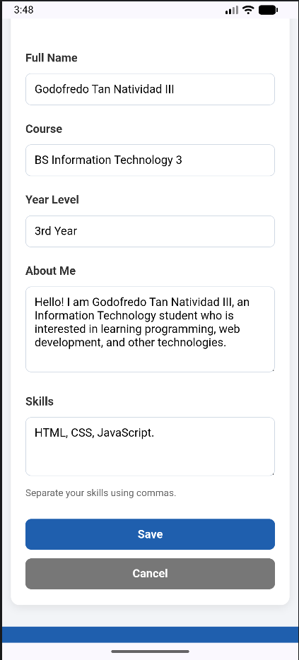
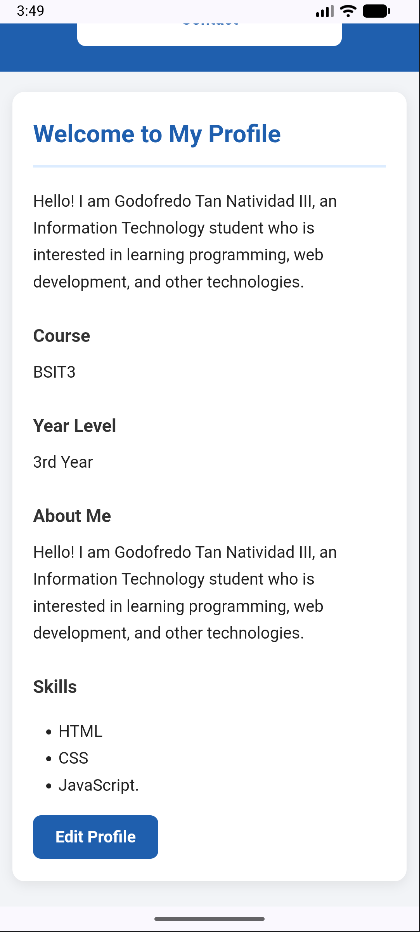

# Natividad Student Profile

## Project Description

This project is a responsive multi-page Student Profile mobile application developed using Apache Cordova, HTML, CSS, and JavaScript. It was created as part of my IT coursework.

The application presents my personal information, background, skills, projects, and contact information through separate pages with consistent navigation and responsive design.

The application also includes an **Edit Profile** feature that allows the user to update profile information dynamically and save the changes using browser localStorage.

## Application Pages

### 1. Profile

The Profile page serves as the homepage of the application. It introduces me with my profile picture, complete name, short tagline, and a brief description.

It also includes the **Edit Profile** feature where the user can update:

* Full Name
* Course
* Year Level
* About Me
* Skills

### 2. About

The About page contains my personal introduction, interests, educational background, and goals.

### 3. Skills

The Skills page displays my programming, web development, problem-solving, and communication skills with short descriptions for each skill.

### 4. Projects

The Projects page shows sample projects I have worked on. Each project includes a project title, description, my role or contribution, and the technologies or tools used.

### 5. Contact

The Contact page provides my email address, GitHub profile, and social media contact information.

## Profile Editing

The Profile page includes an **Edit Profile** function.

The user can:

* Open the Edit Profile form
* Update their Full Name
* Update their Course
* Update their Year Level
* Update their About Me information
* Update their Skills
* Save changes
* Cancel changes

The profile information is updated dynamically without manually changing the HTML content.

## JavaScript Functionality

JavaScript is used to manage the Edit Profile feature.

The JavaScript:

* Loads the saved profile information
* Displays profile information dynamically
* Opens and closes the Edit Profile form
* Validates required fields
* Saves updated information
* Updates the profile after saving
* Handles the Cancel button

The following fields are required:

* Full Name
* Course
* Year Level
* About Me
* Skills

Appropriate validation feedback is displayed when required information is missing.

## Local Storage

The application uses **localStorage** to save the profile information.

The saved information includes:

* Full Name
* Course
* Year Level
* About Me
* Skills

This allows the updated profile information to remain available after closing and reopening the application.

If no saved profile information exists, the application uses the default profile information.

## Navigation

The application uses standard HTML links to navigate between the five pages:

* Profile
* About
* Skills
* Projects
* Contact

Each page contains the same navigation menu, allowing users to easily move between pages and return to the Profile homepage.

No JavaScript is required for page navigation.

## Responsive Design

The application is designed to work properly on different screen sizes, including:

* Desktop
* Tablet
* Mobile

CSS media queries are used to adjust the layout, navigation, spacing, font sizes, and content cards for different screen widths.

The responsive design helps prevent horizontal scrolling, overlapping content, cut-off text, and distorted images.

## UI/UX

The application uses a consistent blue-and-white color scheme, readable typography, clear headings, organized content sections, and easy-to-use navigation buttons.

The design focuses on:

* Consistent layout across all pages
* Clear visual hierarchy
* Readable text
* Proper spacing
* Easy navigation
* Mobile-friendly design
* Accessibility-friendly links
* Descriptive alternative text for the profile image

## Project Structure

```text
Natividad_StudentProfile
├── www
│   ├── index.html
│   ├── about.html
│   ├── skills.html
│   ├── projects.html
│   ├── contact.html
│   ├── css
│   │   └── index.css
│   ├── js
│   │   └── profile.js
│   └── img
│       └── profile.jpg
├── screenshots
│   ├── profile.png
│   ├── about.png
│   ├── skills.png
│   ├── projects.png
│   └── contact.png
├── config.xml
├── package.json
└── README.md
```

## How to Run

1. Install Node.js and Apache Cordova.
2. Open the project folder in Visual Studio Code.
3. Open the terminal in the project folder.
4. Install the project dependencies.
5. Add the Android platform if needed.
6. Start an Android emulator.
7. Make sure the emulator is connected.
8. Run the application using:

```text
cordova run android
```

## Activity 5 Testing

The following functions were tested successfully:

* Edit Profile and Save
* Cancel editing
* Empty-field validation
* Profile persistence after closing and reopening
* Multiple profile updates

All five tests work successfully.

## Screenshots

### Profile


### Edit Profile



### Updated Profile



### About


### Skills


### Projects


### Contact


````


